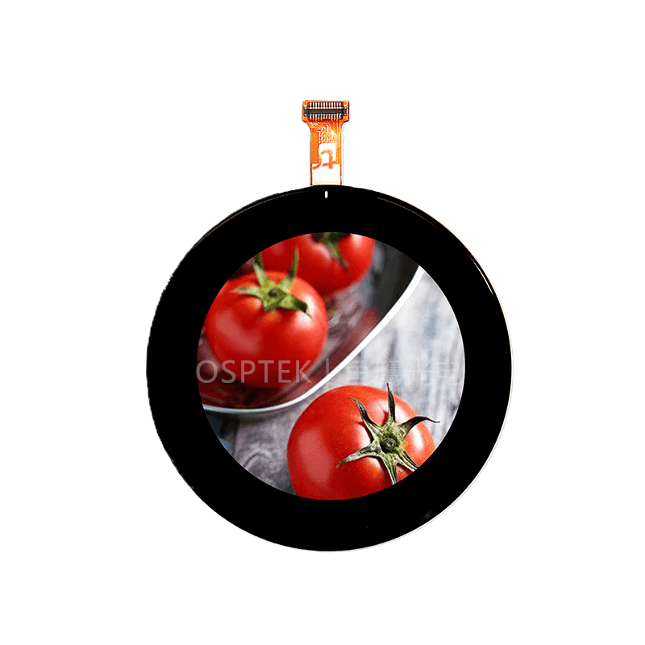

<p align="left"></p>

<h1 align="center">OSPTEK 1.6″ AMOLED 480×480 (ST7802 · MIPI)</h1>

<p align="center"><b>Round AMOLED module · MIPI DSI · ST7802</b></p>

<p align="center"><a href="./README.md">简体中文</a> | English</p>

<p align="center">
  
  
  
  
</p>

<p align="center"></p>

## Contents

- [Overview](#overview)
- [Specifications](#specifications)
- [Sample projects](#sample-projects)
- [Repository layout](#repository-layout)
- [Resources](#resources)
- [Buy](#buy)
- [Support](#support)

---

## Overview

OSPTEK **1.6″ 480×480 AMOLED** is a **MIPI DSI** color display module driven by **ST7802**, with touch controller **CST9220**. The square resolution suits round wearables and compact HMI.

Spec ID (repository name): `1.6-amoled-480x480-mipi-st7802`

Current module version: **AM160Q480480LK4**. Electrical and mechanical details follow [`docs/AM160Q480480LK4.pdf`](./docs/AM160Q480480LK4.pdf).

## Specifications

| Item | Spec |
| ---- | ---- |
| Size | 1.6 inch |
| Type | AMOLED (color) |
| Resolution | 480×480 |
| Interface | MIPI DSI |
| Driver IC | ST7802 |
| Touch IC | CST9220 |

> Full outline, FPC definition, power, and timing follow the product datasheet / driver IC datasheet.

## Sample projects

| Description | Path |
| ---- | ---- |
| ESP32-P4 · ST7802 MIPI + esp-lvgl-port / LVGL9 | [`examples/esp32p4-idf5_st7802-mipi_esp-lvgl-port_lvgl9/`](./examples/esp32p4-idf5_st7802-mipi_esp-lvgl-port_lvgl9/) |
| ESP32-P4 · LVGL9 tear-related demo | [`examples/with-te/esp32p4-idf5_st7802-mipi_lvgl9-common-demo/`](./examples/with-te/esp32p4-idf5_st7802-mipi_lvgl9-common-demo/) |
| ESP32-P4 · EAF animation player | [`examples/eaf/esp32p4-idf5_st7802-mipi_lvgl9_esp-lv-eaf-player/`](./examples/eaf/esp32p4-idf5_st7802-mipi_lvgl9_esp-lv-eaf-player/) |
| ESP32-P4 · ST7802 MIPI display test | [`examples/display-touch-test/esp32p4-idf5_st7802-mipi-dsi/`](./examples/display-touch-test/esp32p4-idf5_st7802-mipi-dsi/) |
| ESP32-P4 · CST9220 touch I2C test | [`examples/display-touch-test/esp32p4-idf5_cst9220-i2c/`](./examples/display-touch-test/esp32p4-idf5_cst9220-i2c/) |

## Repository layout

```text
1.6-amoled-480x480-mipi-st7802/
├── README.md
├── README_EN.md
├── MODULE_VERSION.md
├── LICENSE
├── images/          # README assets
├── docs/            # datasheets, init files
└── examples/        # sample projects
```

## Resources

### Product files

| Resource | Link |
| ---- | ---- |
| Product datasheet (AM160Q480480LK4) | [`docs/AM160Q480480LK4.pdf`](./docs/AM160Q480480LK4.pdf) |
| Driver IC datasheet (ST7802) | [`docs/ST7802_DataSheet_V0.3.pdf`](./docs/ST7802_DataSheet_V0.3.pdf) |
| Touch IC datasheet (CST9220) | [`docs/CST9220_Datasheet_V1.0.pdf`](./docs/CST9220_Datasheet_V1.0.pdf) |
| Init sequence (text) | [`docs/Truly160_480x480_ST7802N_AMOLED_Mipi_init.txt`](./docs/Truly160_480x480_ST7802N_AMOLED_Mipi_init.txt) |
| Timing parameter reference | [`docs/Panel_Parameter_timing.png`](./docs/Panel_Parameter_timing.png) |
| Adapter schematic screenshot | [`docs/adapter-board-schematic.png`](./docs/adapter-board-schematic.png) |
| Adapter board (PCB V2.0) | [`docs/PCB-1.6寸AMOLED屏转接板V2.0.pdf`](./docs/PCB-1.6%E5%AF%B8AMOLED%E5%B1%8F%E8%BD%AC%E6%8E%A5%E6%9D%BFV2.0.pdf) |
| Board-to-board connector datasheet (OK-14F024-04) | [`docs/OK-14F024-04.pdf`](./docs/OK-14F024-04.pdf) |

### Samples

- [ESP32-P4 ST7802 MIPI + LVGL9](./examples/esp32p4-idf5_st7802-mipi_esp-lvgl-port_lvgl9/)
- [ESP32-P4 LVGL9 + TE](./examples/with-te/esp32p4-idf5_st7802-mipi_lvgl9-common-demo/)
- [ESP32-P4 EAF player](./examples/eaf/esp32p4-idf5_st7802-mipi_lvgl9_esp-lv-eaf-player/)
- [ESP32-P4 ST7802 display test](./examples/display-touch-test/esp32p4-idf5_st7802-mipi-dsi/)
- [ESP32-P4 CST9220 touch test](./examples/display-touch-test/esp32p4-idf5_cst9220-i2c/)

## Buy

<p align="center">
  <a href="https://www.aliexpress.com/store/1105701619"></a>
  &nbsp;&nbsp;
  <a href="https://shop110742373.taobao.com/"></a>
</p>

**Overseas (AliExpress)**

- Store: [OSPTEK Official Store](https://www.aliexpress.com/store/1105701619)

**China (Taobao)**

- Store: [鱼鹰光电工厂店](https://shop110742373.taobao.com/)

## Support

- Technical support / product inquiry: <luyu@osptek.com>
- QQ group (China): **985881096**
- Website: <https://osptek.com/>
- Feel free to open an Issue in this repository if you have any questions

---

<p align="center"><sub>© 2026 OSPTEK · Materials in this repository are licensed under CC BY 4.0</sub></p>
